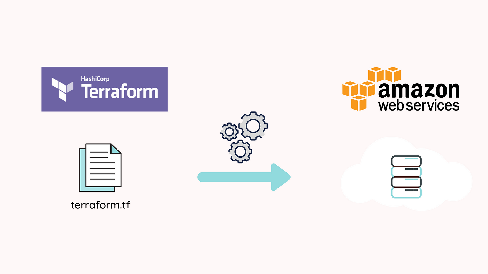

# Infrastructure as a code with Terraform and AWS

#### It is small project which helps to build the basic understanding of aws and terraform use cases
#### In this project we will create a simple instance using aws and terraform
#### The terraform is used to create resources scripts
#### If you have some basic understanding of the terraform and aws you can build it easily 
#### Prerequisites
1. AWS account or free tier
2. terraform setup
3. you should install dependencies
4. After installation you should configure the dependencies
5. install the extension of terraform by hashicorps

## Let's start the project
### Step 1: create an iam user and after create it credentials and give it administration access.
### Step 2: type aws configure in the terminal and put the credentials like access key and secret key and region name or output format Note : the region name should be same as the aws region in which you want to create instances.
### Step 3: copy the code from main.tf and put it into your script
### Step 4: type commands in terminals: terraform init, then , terrafrom validate, then terrafrom plan, then ,terrafrom apply (to create the instance ), if you want to delete the resources then, terraform destroy
### Step 5: open the aws instance and you see the instance is created

#### You can take the help of official documentation of terraform 

## Thank you !!!
